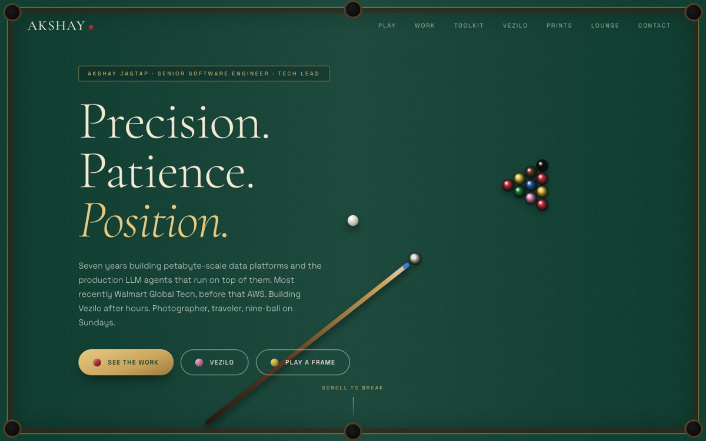
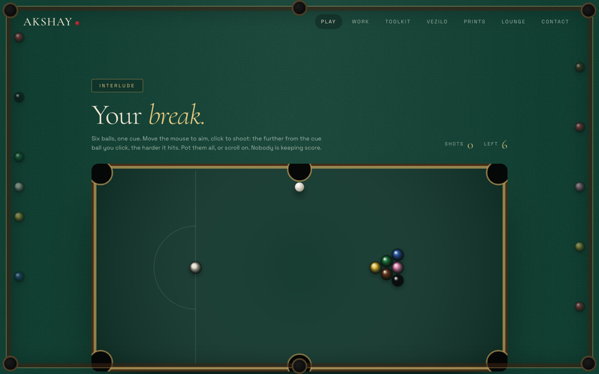
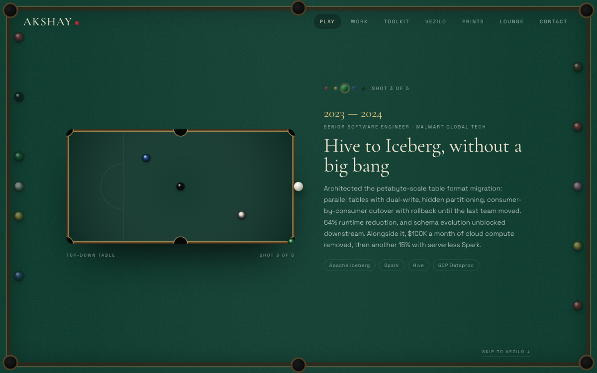

# Akshay Jagtap — portfolio

A snooker-club themed personal site: the rack breaks as you scroll the hero, there is a **playable
six-ball pool table**, each role in the experience section pots a ball, and the balls re-rack at
the end.

Built with Next.js 15 (App Router), React 19 and TypeScript. No UI framework, no animation
library, no canvas library: everything is plain CSS and a few small canvas components.







## Run it

```bash
npm install
npm run dev        # http://localhost:3000
```

```bash
npm run build && npm start   # production build
npm run typecheck            # tsc --noEmit
```

## Edit the content

Everything written on the page lives in [`lib/content.ts`](lib/content.ts):
name, tagline, intro, email and links, the five roles (each one is a "shot"),
the toolkit groups, the Vezilo copy, the prints, the lounge tiles and the contact block.

A few things behave conditionally, so the page never shows a dead end:

- **Links.** `site.links` is a list; any entry with an empty `href` is left off the page.
  Instagram is currently empty, waiting for a profile URL.
- **Vezilo.** While `vezilo.cta` and `vezilo.href` are empty, the section shows the
  `vezilo.status` chip ("Work in progress") instead of a button. Fill both in to turn it
  back into a link.
- **Photos.** Drop files into `public/photos/` and set `src` on the matching entry in
  `prints` (for example `src: "/photos/big-sur.jpg"`). Entries without a `src` show a
  placeholder gradient, which is what they all do today.

### Still to fill in

- Instagram URL in `site.links`
- Real photographs, titles and years in `prints`
- Vezilo link and copy once it is ready to show
- The year ranges on the five roles split one long Walmart tenure into phases; adjust to taste

## Deploy on Vercel

1. Push this folder to a GitHub repository.
2. In Vercel, **Add New Project**, import the repository, keep the detected Next.js settings.
3. Deploy. Every push to the default branch redeploys.

No environment variables are required to deploy. Two optional ones matter for search:

| Variable | What it does |
|---|---|
| `NEXT_PUBLIC_SITE_URL` | The canonical origin, e.g. `https://akshayjagtap.com`. Set this as soon as a custom domain is attached. Without it the site falls back to Vercel's production URL, which is correct but less memorable. |
| `NEXT_PUBLIC_GOOGLE_VERIFICATION` | The token from Google Search Console, if verifying by meta tag rather than DNS. |

Both are read at build time, so redeploy after changing them.

## Search (SEO)

Everything on the page is server-rendered, so crawlers see the full text without running
JavaScript. What ships:

- **Metadata** in `app/layout.tsx`: title, a description trimmed to fit Google's snippet,
  canonical URL, robots directives, Open Graph and Twitter cards.
- **Structured data** in `lib/seo.ts`: a schema.org `Person` (name, alternate spellings,
  job title, location, email, LinkedIn and GitHub as `sameAs`, skills as `knowsAbout`)
  plus `WebSite` and `ProfilePage`. Only facts visible on the page are marked up.
- **`/robots.txt`** and **`/sitemap.xml`**, generated from the resolved site URL.
- **Link preview image** at `/opengraph-image` (1200x630), generated at build time from
  `app/opengraph-image.tsx`. Also served as the Twitter card.
- **Icons**: `app/icon.svg` for the favicon, `app/apple-icon.tsx` for iOS.

### After the first deploy

1. Add the site to [Google Search Console](https://search.google.com/search-console) and
   [Bing Webmaster Tools](https://www.bing.com/webmasters), verify, and submit
   `https://your-domain/sitemap.xml`.
2. Use "Request indexing" on the homepage so it is crawled in days rather than weeks.
3. Link to the site from the LinkedIn profile (Contact info → Website) and from the GitHub
   profile bio. Those two links are the strongest signal that this site is the right
   "Akshay Jagtap", and they are also how Google connects the profiles in the `sameAs` list.
4. Check the rendered card with the
   [Facebook sharing debugger](https://developers.facebook.com/tools/debug/) and
   [LinkedIn post inspector](https://www.linkedin.com/post-inspector/).
5. Validate the structured data with the
   [Rich Results Test](https://search.google.com/test/rich-results).

### What ranks, and what does not

Name searches ("Akshay Jagtap", "Akshay Kacharaj Jagtap") and specific phrases
("Akshay Jagtap portfolio", "Akshay Jagtap software engineer") are winnable, usually within
a few weeks of indexing, and a matching custom domain helps a lot.

Broad head terms like "best portfolio website" or "best portfolio design" are not reachable
through on-page work. Those results are held by directories and publishers with enormous
backlink profiles. The route to that kind of traffic is being featured: Awwwards, CSS Design
Awards, Godly, Land-book, One Page Love, plus sharing the playable table on X, Reddit or
Hacker News. Each feature is a backlink, and backlinks are what those terms are actually
ranked on.

## How it is put together

| Piece | File | Notes |
|---|---|---|
| Page order | `app/page.tsx` | Hero → playable table → experience → Vezilo → prints → lounge → contact |
| Background break / re-rack | `components/TableBackground.tsx` | Fixed canvas driven by scroll position; off on touch, narrow screens and reduced motion |
| Cue-ball cursor + ripples | `components/Cursor.tsx` | Same on/off rules; hides itself over the playable table |
| Playable table | `components/PoolGame.tsx` | Six balls + cue ball, aim with the pointer, click/tap to shoot, power by distance, pockets, scratches, re-rack. Listens for the `portfolio:rerack` event |
| Five shots (experience) | `components/Experience.tsx` | Pinned section; one ball potted per role, fully scrubbable, skip link |
| Toolkit | `components/Toolkit.tsx` | Grouped skills plus the recognition footnote |
| Prints rail | `components/Prints.tsx` | Vertical scroll drives the horizontal wall |
| Contact + Re-rack | `components/Contact.tsx` | Re-rack button scrolls to the top and resets the table |
| Drawing helpers | `lib/draw.ts` | Balls, cue, table, easing |
| Styles | `app/globals.css` | Design tokens at the top |

`designs/` holds the original design explorations (static HTML samples and screenshots).
It is not part of the build.

## Accessibility and fallbacks

- `prefers-reduced-motion` turns the canvas layers off and removes scroll reveals.
- Touch devices get tap-to-shoot and touch-specific copy; the decorative layers are disabled.
- All navigation is real anchors with keyboard focus styles; canvases carry labels.

## Make it yours

If you like this and want to build your own on top of it, please do. Fork it, then:

1. Replace everything in [`lib/content.ts`](lib/content.ts) with your own details.
2. Drop your photographs into `public/photos/` and point the `prints` entries at them.
3. Change the palette at the top of [`app/globals.css`](app/globals.css) if green is not your colour.
4. Update `seo.fallbackUrl` and set `NEXT_PUBLIC_SITE_URL` to your domain.
5. Delete `docs/` and this section.

A star is appreciated, and I would love to see what you build with it.

## License

Code and design: **PolyForm Noncommercial License 1.0.0**, plus an additional permission
from me. See [LICENSE](LICENSE) for the full text. The short version:

**You may**, without asking and without owing me anything:

- use this, changed however you like, as your own personal portfolio or personal site,
- keep it online while you use it to look for a job, freelance work or clients,
- learn from it, take pieces of it, break it apart.

**You may not**, without asking me first:

- build sites for other people or organisations in exchange for payment using this,
- sell this, or something derived from it, as a template, theme or product.

**Not licensed at all**: my name, biography, employment history, project descriptions,
photographs and the Vezilo name. Swap those out for your own before you publish.

Want to do something commercial with it? Email akshayjagz@gmail.com and we will sort it out.

Note that a noncommercial restriction means this is not "open source" by the OSI
definition, which is deliberate.
